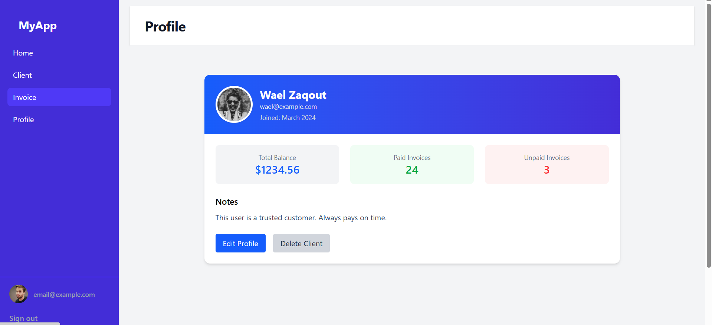

# Laravel + Vue Project

This is a full-stack project that combines **Laravel (API backend)** with **Vue.js (frontend)** to build a modern web application.

---

## ⚙️ Features

- Laravel 11 API
- Vue 3 + Vite
- Tailwind CSS or Bootstrap
- Authentication and dynamic components
- Clean folder structure

---
## 🖼️ Image Gallery

### 📷 Main View


### 📄 Invoice View


---

## 🚀 How to Run Locally

```bash
# Backend (Laravel)
composer install
cp .env.example .env
php artisan key:generate
php artisan migrate
php artisan serve

# Frontend (Vue)
cd frontend
npm install
npm run dev
